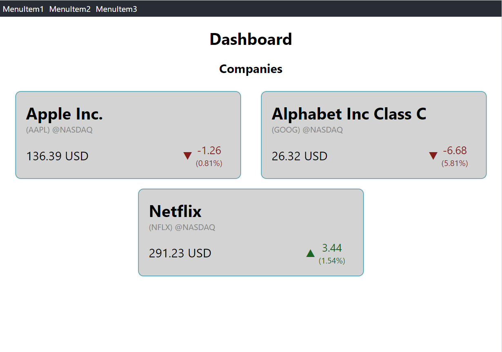
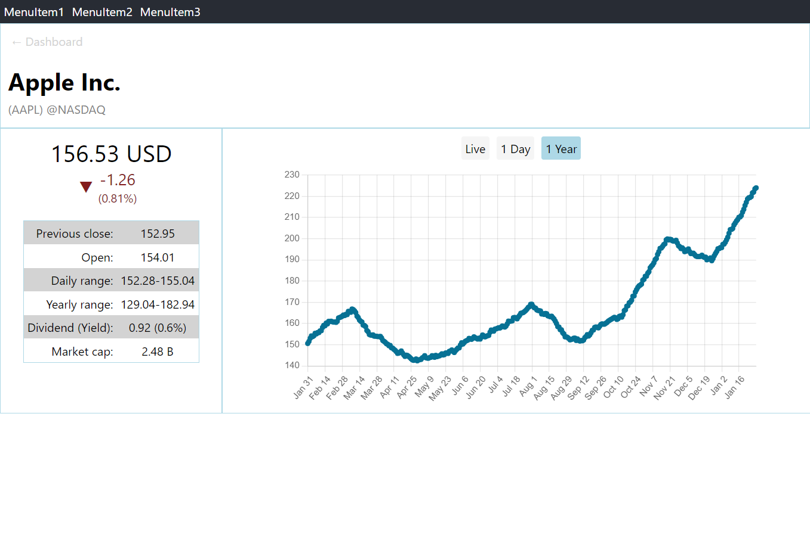
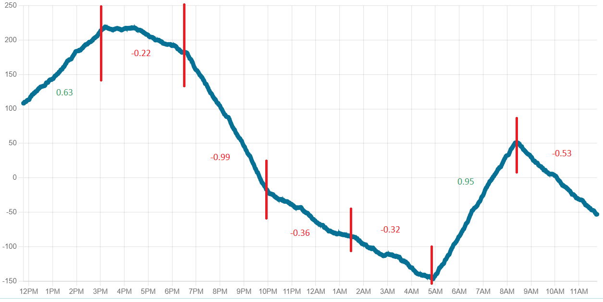

# Stock Web App

This project is created for learning and practicing technologies. A server and the corresponding client is implemented to 
simulate a stock exchange website.

| Dashboard                | Stock details             |
|--------------------------|---------------------------|
| |  |

# Technologies
- Server is an ASP.NET WebApi (.NET6)
- Client is a ReactJS application (TypeScript, React Hooks, SCSS)
- Both client and server can be run in docker
- For live stock data Websocket connection is used

# Setting up

## Setting up locally

You can run the server from Visual Studio. On the first run accept the creation of a self-signed certificate.
The server will run on `https://localhost:3001`. A Swagger is also accessible at `https://localhost:3001/swagger/index.html`.

For the client npm packages have to be installed with the `npm install` command.
After that you can start the client with the `npm run start` command. The client will run at `http://localhost:3000/`

## Setting up for docker
For running the server in docker an SSL certificate is needed. You can create a self-signed sertificate for local development 
with the `dotnet dev-certs` command.

1. Clean existing certificates if any: `dotnet dev-certs https --clean`
2. Create a certificate under the `httpcert` directory with the following command:
    
    `dotnet dev-certs https -ep .\httpcert\StockWebApp.pfx -p <YOUR PASSWORD>`

3. Trust the certificate: `dotnet dev-certs https --trust`
4. Update the `ASPNETCORE_Kestrel__Certificates__Default__Password` environment variable in the `docker-compose.yml` to the password given for the certificate.

For running the instances in docker just simply run the `docker-compose up` command (from the directory of `docker-compose.yml`).
Both client and server will run in a container. The server will run on `https://localhost:3001` while the client on `http://localhost:3000`
The certificate created previously will be mounted to the server directory `/https/` via docker volume.

# Technical details

This application is not connected to real stock databases. Part of the data is retrieved from file, other part is generated by the backend application.

The server provides several endpoints where stock information and price information is available.

- `/companies` returns the list of companies that are configured
- `/stocks` lists the stocks with basic information (like price, currency, and company)
- `/stocks/{symbol}` detailed infomation about a single stock
- `/stocks/{symbol}/prices` generated prices for a range of year or day (depending on the `interval` query param). For a year the prices are sampled daily, while for a day prices are generated for every minute.
- `/stocks/{symbol}/prices/live` a websocket connection for sending generated price values constantly.

The client application uses these endpoints to show the stock data on the Dashboard and on the Stock details pages.

Since this application is only a simulation the focus was not on showing accurate, consistent or realistic data.
Stock information is constant and saved in a file, while daily and yearly prices are generated on startup. Live price data is generated on the fly.

## Generating price data

For generating stock prices the intent was to generate realistic looking data.
For this I implemented an algorithm that generates prices randomly yet looking similar to real graphs.

The `NextPriceGenerator` class is based on a `startValue` and a `feed` function generating random values. This class has a `Force` property as well.
The new price is generated in the following way: _previous price + random feed + force_.
The random feed function is usually an instance of 
`RandomPriceDeltaGenerator.Generate` which  generates values between -1.0 and 1.0.
For producing a series of price data the `Force` property is modified from time to time giving the graph the characteric ups and downs (see `StocksService.GeneratePrices`).
An example of generated graph with the corresponding forces can be seen in the following image:
